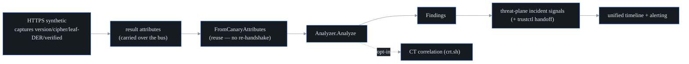

# TLS / certificate observability

## What it is

Every time probectl's HTTP synthetic canary makes an HTTPS request, a TLS
handshake happens, and that handshake *already tells you* the server's
certificate, TLS version, and cipher. The **TLS observability** layer harvests
that information probectl has **already captured** and analyzes it for posture
problems: certs about to expire, weak keys, deprecated TLS versions, untrusted
chains, and so on. (The observation model is source-tagged — `http` | `ebpf` —
so the eBPF L7 plane can feed the same analyzer; today the HTTPS synthetic is
the live source. See the coverage caveat below.)

The key design choice is in the name: it **observes**, it does not re-probe. It
never opens a second connection or re-handshakes a target just to inspect the
cert — that would be wasteful and would double the load on the very services
you're watching. It reuses what the existing probe saw. This is the
trustctl-adjacent security win: cheap, because the handshake came for free.

## How it works

The flow, step by step:

1. **Capture.** The HTTPS canary records the TLS facts it observed during its
   normal handshake — the negotiated version and cipher, whether the chain
   verified, and the leaf certificate's raw DER bytes — as result attributes
   (`tls.protocol.version`, `tls.cipher`, `tls.server.verified`,
   `tls.server.cert`). The observation also carries `tls.ja3` / `tls.ja3s`
   fingerprint fields when a capture source supplies them — the HTTPS canary
   does not emit them today.
2. **Rehydrate, don't re-fetch.** `threat.FromCanaryAttributes` turns those
   attributes back into a `TLSObservation` — parsing the leaf DER into a real
   certificate object. It opens **no** new connection. If the result carried no
   TLS (a plain HTTP probe), it returns "nothing to analyze".
3. **Analyze.** `threat.Analyzer.Analyze` inspects the handshake facts and the
   parsed leaf, emits severity-scored findings, and (when there's a renewable
   cert problem) builds a trustctl handoff payload.

## What it flags

From the captured handshake and the parsed leaf certificate, the analyzer flags:

- **expired** certs (critical) and **expiring-soon** certs (within a
  configurable window — `PROBECTL_TLS_EXPIRY_WARNING`, default 21 days);
- **not-yet-valid** certs;
- **self-signed** certs (issuer == subject);
- **weak RSA keys** (below 2048 bits);
- **deprecated TLS** (1.0 or 1.1);
- **weak ciphers** (anything matching RC4 / 3DES / DES / NULL / EXPORT / MD5 /
  anonymous);
- an **untrusted chain** — the capturing client's own verification failed
  (critical).

Each finding is severity-scored and surfaced as a **threat-plane incident
signal**. Crucially, it is a **signal, not an IPS**: probectl never blocks
traffic or sits inline. It tells you the cert is bad; acting on it is your call.

## trustctl handoff

A certificate finding is *actionable* — usually "renew or replace this cert" — so
the analyzer builds a **trustctl handoff** payload: the cert's subject, issuer,
SANs, serial, expiry, and the reason. When `PROBECTL_TRUSTCTL_URL` is set, it
also assembles a one-click deep link
(`<trustctl>/renew?domain=…&serial=…&reason=…`) carried in the signal
attributes, so an operator can jump straight from "this cert is expiring" to the
renewal flow in the sibling product.

## CT correlation (opt-in)

When you enable it with `PROBECTL_CT_ENABLED=true`, probectl correlates a leaf's
serial number against **Certificate Transparency** logs (crt.sh by default;
`PROBECTL_CT_ENDPOINT` overrides). A serial that CT has **never seen** is
flagged as an info-severity *issuance anomaly* — a possible sign a cert was
minted outside the normal pipeline.

It is **off by default** on purpose: it's an outbound fetch to a third party,
which collides with the no-phone-home / sovereignty stance. When enabled it
behaves like every external feed in probectl — it respects crt.sh's AUP and rate
limits, fetches over validated TLS, and **degrades gracefully**: a CT source
that's down or throttled is a silent no-op, never an error that breaks posture
analysis.

## Coverage caveat — what feeds the inventory, and the Go-server blind spot

The observation model defines two capture sources, and they see different
things:

- The **HTTP synthetic** path (`source: http`) sees the certificate
  **probectl's own client** negotiated. This always works — it's probectl
  initiating the handshake — and it is the path that feeds the posture
  inventory today.
- The **eBPF L7** path (`source: ebpf`) is the designed-in second source: it
  would see **server-side** TLS by reading plaintext at the TLS library's
  read/write calls. It is not wired into the posture pipeline yet — and when it
  is, it carries a structural blind spot: a **Go server terminates TLS inside
  the Go runtime**, not in a system TLS library probectl's uprobes attach to,
  so a Go server's TLS stays invisible to the eBPF path until Go-runtime
  uprobes land (the same Go-TLS limitation described in
  [`ebpf-feasibility.md`](ebpf-feasibility.md)).

The synthetic path is unaffected by either caveat: anything you point an HTTPS
test at lands in the inventory.

## Out of scope

- **Malicious-cert / JA3 threat-intel correlation** — matching cert
  fingerprints and JA3 fingerprints against feeds like SSLBL is the
  *threat-intel* layer's job (it reuses the same captured TLS via the
  analyzer's `WithIntel` hook), not this posture layer's. Here, **JA3 / JA3S
  are carried as observed fields when a source supplies them, never scored**.
- **Full NDR detections** — also a separate layer.

## The posture surface

The analyzed posture is retained as a tenant-scoped, in-memory **inventory** (the
latest posture per target, bounded per tenant, clean certs included) and served
at `GET /v1/tls/posture` (RBAC `threat.read`, added in migration 0023; a
`collector_running=false` flag distinguishes an unwired collector from a
genuinely empty fleet, so an empty page never lies about why).

The web surface lives at `/security`:

- the certificate inventory (filterable by issuer/SAN text and by flag —
  expired / expiring / weak / self-signed / CT / intel);
- an **expiring-soon worklist** (≤30 days, soonest first);
- a per-cert detail view whose **trustctl handoff is the analyzer's payload
  verbatim** — you copy the exact JSON and use the payload's own deep link, never
  a value re-derived in the browser.

The inventory rebuilds itself from the result stream after a restart.
