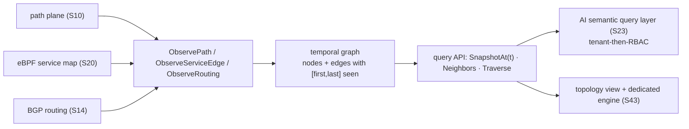

# Topology graph (S30 — F40 foundation)

`internal/topology` is probectl's live, **versioned/temporal**, **tenant-scoped**
network graph. It is built from the planes this milestone produced — path (S10),
the eBPF service map (S20), and routing (S14) — and it is the model the AI
semantic query layer (S23) traverses for root-cause analysis, the topology view
(S43) renders, and the dedicated graph engine (S43) later replaces.

## Model

- **Nodes** (`NodeKind`): `agent`, `hop` (traceroute responder), `host` (path
  target), `service` (eBPF workload), `prefix` (BGP), `as`. Stable ids —
  `hop:<ip>`, `service:<workload>`, `as:<asn>`, `prefix:<cidr>`, ….
- **Edges** (`EdgeKind`): `path` (hop→hop adjacency), `flow` (service→service),
  `routing` (as→prefix). Edge attributes follow OTel conventions where they exist
  (`destination.port`, `network.transport`, `network.protocol.name`).

## Versioning / temporal (designed in, not bolted on)

Every node and edge carries a **validity interval** `[FirstSeen, LastSeen]`;
re-observation extends it and merges attributes. So:

- `SnapshotAt(t)` returns the graph **as it was at time `t`** — the state at an
  incident time, which is exactly what RCA needs.
- `Latest()` returns the full current graph.

## Query API (the contract S23 / S43 consume)

The `Store` interface is tenant-scoped — every call takes a tenant and **never
returns another tenant's graph** (CLAUDE.md §7 guardrail 1):

- `SnapshotAt(tenant, t)` / `Latest(tenant)` — the graph, or its state at `t`.
- `Neighbors(tenant, nodeID, t)` — adjacency.
- `Traverse(tenant, from, to, t)` — shortest directed path (the RCA traversal).
- `Observe{Path,ServiceEdge,Routing}(tenant, …, at)` — fold telemetry in.

`MemoryStore` is the in-memory implementation; the Postgres/ClickHouse adjacency
backing and the S43 dedicated engine implement the **same interface**. The
`From{Path,ServiceEdge,BGPEvent}` adapters map the real signal types (S10/S20/S14)
into the builder inputs, so a bus consumer feeds the graph from live telemetry.

## Visualization

`ToViz(snapshot)` projects a snapshot to a layout-agnostic node/edge JSON shape
(`Viz`) for the S43 topology view and the UI; positions are computed client-side.

## Full dependency graph + what-if (S43)

S43 completes the S30 foundation:

- **All planes feed the live graph.** `TopologyConsumer` folds eBPF service
  edges, BGP routing events, and device telemetry from the bus; path
  discoveries fold in at save time. Device nodes link to the hops they carry
  via `ObserveDevice(DeviceInput{InterfaceIPs})` when telemetry exposes
  interface IPs — when it does not (SNMP/gNMI today), device nodes exist
  without links and the gap is REPORTED (see coverage below), never silent.
- **What-if / impact simulation** (`Simulate`): fail any node (`hop:…`,
  `service:…`, `as:…`, `prefix:…`, `device:…`, `agent:…`) or edge
  (`from|kind|to`) at any time (the versioned-graph contract; zero time =
  the live graph) and get the prediction: **broken** agent→target paths (no
  surviving route), **rerouted** paths (with the surviving route), impacted
  services (transitive callers over flow edges), impacted prefixes (origin-AS
  failures), newly disconnected nodes, and SLO impact via the `SLOSource`
  seam (the S45 engine plugs in; absent = an explicit coverage note).
  Unknown targets are an error — never an empty "no impact". The simulation
  is read-only; acting on predictions is S-EE5 (human-gated).
- **Coverage honesty** (the S43 watch-out): every snapshot and every Impact
  carries per-plane edge counts plus notes for missing planes ("no flow-plane
  edges — service impact may be incomplete"), because simulation accuracy
  depends on graph completeness.
- **Dedicated graph engine.** `IndexedStore` implements the same `Store`
  contract with forward/reverse adjacency indexes (Neighbors/Traverse are
  degree-proportional) — the L/XL engine, selected by
  `PROBECTL_TOPOLOGY_ENGINE` (`indexed` default | `memory`). The switch is
  transparent behind the S30 query API; the XL-scale test proves correctness
  + interactivity at ~30k nodes. An external graph-database adapter
  implements the same interface when a deployment outgrows one process.

### API + surface

- `GET /v1/topology[?at=RFC3339]` — the tenant's graph (live or as-it-was),
  layout-agnostic nodes/edges + the coverage block (`topology.read`).
- `POST /v1/topology/whatif {target, at?}` — the simulated Impact.
- The **Topology** page renders the layered graph (kind columns, capped for
  legibility on dense graphs with an honest "showing N of M"), node
  drill-down, time travel, and the what-if overlay (failed element dashed,
  impacted elements highlighted, broken/rerouted lists with routes). PR1 is
  the functional view; PR2+ iterates layout/drill-down/change-overlay polish
  (design-led, multi-PR).

## Out of scope (later)

Acting on predictions (S-EE5); the change-event overlay on the viz (PR2+);
dependency mapping beyond the available signals. S23's RBAC-aware query layer
already sits on top of this foundation.
