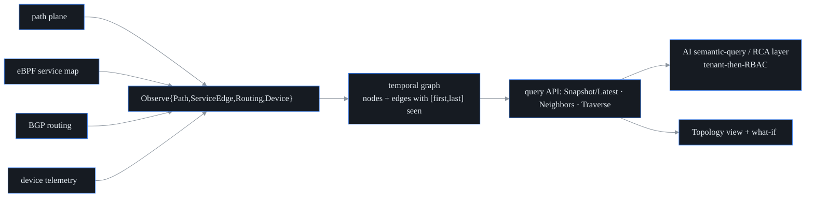

# Topology graph

## What this is

A network has a *shape*: agents reach targets through a chain of router hops,
services call other services, autonomous systems originate prefixes, devices
carry interfaces. `internal/topology` is probectl's live model of that shape — a
**tenant-scoped**, **versioned (time-travelling)** graph that stitches together
the signals the other planes already produce:

- **path** discoveries (traceroute) → agent → hop → hop → host adjacency;
- the **eBPF service map** → service → service call edges;
- **BGP routing** events → autonomous-system → prefix origin edges;
- **device telemetry** → device nodes (and device → hop links where the
  telemetry exposes interface IPs).

It is the substrate two things sit on top of: the AI semantic-query / root-cause
layer traverses it to explain *why* an incident happened, and the Topology page
in the UI renders it. Because it is one shared graph, a single failure can be
reasoned about across planes — "this hop went down, which broke these paths,
which back these services, which back these SLOs."

## Model

A node and an edge each have a **kind** and a **stable id**, so the same router
or service observed by two different planes folds into one vertex.

- **Nodes** (`NodeKind`): `agent`, `hop` (a traceroute responder / L3 hop),
  `host` (a path target), `service` (an eBPF workload), `prefix` (a BGP prefix),
  `as` (an autonomous system), `device` (a managed network device). Ids are
  derived from the identity, so they're stable across observations:
  `agent:<id>`, `hop:<ip>`, `host:<ip>`, `service:<workload>`, `prefix:<cidr>`,
  `as:<asn>`, `device:<address>`.
- **Edges** (`EdgeKind`): `path` (hop → hop adjacency), `flow` (service →
  service), `routing` (as → prefix), `device` (device → the hop it carries, via
  an interface IP). An edge's canonical id is `from|kind|to`. Edge attributes
  follow OTel conventions where they exist — a `flow` edge carries
  `destination.port`, `network.transport`, and `network.protocol.name`.

## Versioning / temporal (designed in, not bolted on)

Every node and edge carries a **validity interval** `[FirstSeen, LastSeen]`.
Re-observing an element extends its interval and merges its attributes, so the
graph remembers *when* each thing existed — which is exactly what root-cause
analysis needs (the graph as it was at the incident moment, not as it is now).

- `SnapshotAt(tenant, t)` returns the graph **as it was at time `t`**.
- `Latest(tenant)` returns the full current graph.

## Query API (the contract everything else consumes)

The `Store` interface (`internal/topology/store.go`) is tenant-scoped: every
method takes a tenant and **never returns another tenant's graph** — tenant
isolation is probectl's outermost boundary (see
[`security/tenant-isolation.md`](security/tenant-isolation.md)).

- `SnapshotAt(tenant, t)` / `Latest(tenant)` — the graph, or its state at `t`.
- `Neighbors(tenant, nodeID, t)` — a node's adjacency at `t`.
- `Traverse(tenant, from, to, t)` — the shortest directed path between two nodes
  (the traversal RCA walks).
- `Observe{Path,ServiceEdge,Routing,Device}(tenant, …, at)` — fold one plane's
  telemetry into the graph.

`MemoryStore` is the simple in-memory implementation. The `From{Path,
ServiceEdge,BGPEvent}` adapters (`internal/topology/adapters.go`) map the real
signal types into the builder inputs, so a bus consumer can feed the graph
straight from live telemetry. The indexed engine below and any external
graph-database adapter implement this *same* interface — callers never change.

## All planes feed the live graph

`TopologyConsumer` (`internal/control/topologyapi.go`) folds the streams the
control plane already receives into the graph: eBPF service edges
(`probectl.ebpf.flows`), BGP routing events (`probectl.bgp.events`), and device
telemetry (`probectl.device.metrics`). Path discoveries fold in at save time.
Every batch's claimed tenant is verified against the agent registry; unscoped or
unverifiable records are dropped (guardrail 1).

Device → hop linkage depends on the telemetry exposing interface IPs. When it
does (`ObserveDevice` with `InterfaceIPs`), the device node links to the hops it
carries. When it does not — which is the case for the SNMP/gNMI device telemetry
today — the device node still exists, but **without** links, and that gap is
**reported** as a coverage note (below), never silently treated as "complete."

## What-if / impact simulation

`Simulate` answers: *"if node or link X fails, what breaks?"* It runs on a
snapshot of the versioned graph (a zero time = the live graph), removes the
failed element, and recomputes reachability. Fail any node (`hop:…`, `service:…`,
`as:…`, `prefix:…`, `device:…`, `agent:…`) or any edge (`from|kind|to`) and you
get:

- **broken** agent→target paths — routes with no surviving alternative;
- **rerouted** paths — with the surviving route returned alongside the original;
- **impacted services** — the transitive callers of a failed service/host
  (reverse reachability over `flow` edges);
- **impacted prefixes** — prefixes a failed AS originated (a failed prefix is its
  own impact);
- **disconnected** nodes — reachable from some agent before, from none after;
- **SLO impact** — via the `SLOSource` seam (when the SLO engine is wired;
  absent = an explicit coverage note, never a silent empty).

Two honesty rules matter. First, an **unknown target is an error**, never an
empty "no impact" — a typo in a simulation must not look like a clean result.
Second, simulation accuracy depends on graph completeness, so every result
carries a **coverage block** — per-plane edge counts plus notes for missing
planes ("no flow-plane (eBPF) edges — service impact may be incomplete"). The
simulation is strictly **read-only**: it runs on a copy and never mutates the
graph. Acting on a prediction is a separate, human-gated capability (see
[`remediation.md`](remediation.md)) — probectl predicts, a human decides.

## Visualization

`ToViz(snapshot)` projects a snapshot to a layout-agnostic `Viz` shape — just
nodes (`id`, `kind`, `label`) and edges (`from`, `to`, `kind`, `label`). The UI
computes positions client-side, so the server stays layout-agnostic.

## Engine: in-memory vs indexed

`IndexedStore` implements the same `Store` contract as `MemoryStore`, but backs
it with forward/reverse adjacency indexes, so `Neighbors` and `Traverse` are
proportional to a node's degree instead of the whole edge set — the behaviour
large graphs need. The engine is selected by `PROBECTL_TOPOLOGY_ENGINE`
(`indexed`, the default | `memory`); the switch is transparent behind the query
API. A scale test exercises both correctness and interactivity at roughly 30k
nodes. An external graph-database adapter can implement the same interface when
a deployment outgrows a single process.

## API + surface

- `GET /v1/topology[?at=RFC3339]` — the caller's tenant graph (live, or as it was
  at `?at=`), in the layout-agnostic node/edge shape plus the coverage block.
  Permission: `topology.read`. (When topology isn't wired on a deployment, the
  endpoint returns `topology_running: false` with empty node/edge lists.)
- `POST /v1/topology/whatif {target, at?}` — the simulated impact for failing one
  node or edge. Permission: `topology.read`. An unknown target is a `404`.
- The **Topology** page renders the layered graph (columns by kind, capped for
  legibility on dense graphs with an honest "showing N of M"), node drill-down,
  time travel, and the what-if overlay (failed element dashed, impacted elements
  highlighted, broken/rerouted lists with their routes).

## Out of scope (by design)

Acting on what-if predictions (that's a separate, human-gated remediation
capability); dependency mapping beyond the signals the planes actually emit
(probectl links what it observes, and reports the gaps where it can't). The
AI/RBAC-aware query layer sits *on top of* this graph, enforcing tenant first,
then RBAC — the topology store itself is the tenant-scoped foundation.
